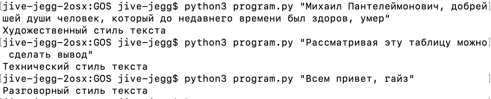

# GOS_1C

ФИО: Халайджи Александр Константинович

Тут у меня есть решение задачи 2.2

Я писал свое решение для корпуса русских текстов, поэтому тестировать ее тоже надо на русском тексте

Написал по сути модель, которая работает через tf-idf векторизацию, при этом дальнейший шаг протестировал из двух: логистическая регрессия и нейронная сеть.

Оказалось, что качество у логистической регрессии практически не отличается, а при этом объем модели достаточно большой. По этой причине было решено использовать логистическую регрессию в паре к tf-idf.

Про сбор датасетов написано в ноутбуках, также в ноутбуках есть ссылки на колаб. Но для удобства вынесу эти ссылки сюда:

1 - сбор датасетов, поиск и обучение модели - https://colab.research.google.com/drive/1wC4MEiz0zC8GkHikQ5D1x7Kk4E9sDsBQ?usp=sharing

2 - тестовый запуск моего скрипта из колаба - https://colab.research.google.com/drive/1XAjg5qMpdu4bpPgmywliBQqnKPfPSGMq?usp=sharing

Качество на отложенной тестовой выборке в моем датасете - 93.5% точности определения (доля верно угаданных классов)

